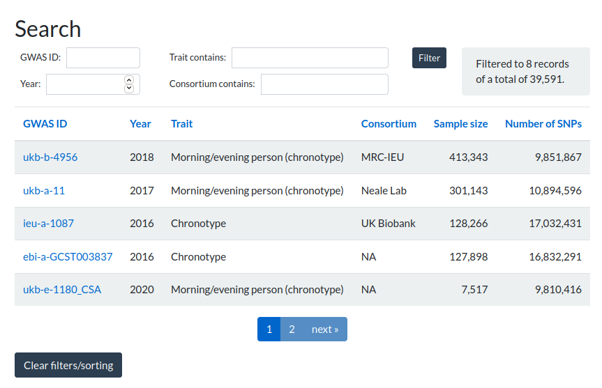

# Mendelian Randomisation
Mendelian Randomisation analysis to explore the causal relationship between a potentially modifiable risk factor and an outcome. This script compacts the input and analysis steps in TwoSampleMR. It allows command line input of the instrumental data for 3 approaches - 1) top independent loci, 2) full summary statistics or 3) Using MRBase data. 

The aim of this script is to allow fast, standardised analysis of numerous traits using pre-release and MRBase data.

<!-- GETTING STARTED -->
## Getting Started
### Packages:
- <code>optparse</code>
- <code>TwoSampleMR</code>

## Pre-processing:
If using approaches 1 or 2, you need to match format column names correctly. The column names must include pos, effect_allele, other_allele, eaf, beta and pval.

Column names can be edited with sed:

<code>sed -i -e '1s/BP/pos/' -e '1s/A1/effect_allele/' -e '1s/A2/other_allele/' -e '1s/FRQ_A_67390/eaf/' -e '1s/OR/beta/' -e '1s/SE/se/' -e '1s/\tP\t/\tpval\t/' PGC3-cp.tsv</code>

That says, on line 1 only, substitute BP with pos, A1 with effect_allele, etc. Note that '\t' is included for the 'P' column to avoid replacing 'SNP' with 'SNPval'. 

<!-- USAGE EXAMPLES -->
## Flags:
- <code>-i</code>/<code>--instruments</code>\*:  The approach being used for MR analysis. Depending on your desired approach, enter toploci, sumstats or mrbase.  
- <code>-s</code>/<code>--snps</code>: The file location for exposure data. Applicable if </code>-i</code> is toploci or sumstats.
- <code>-o</code>/<code>--outcome</code>\*: Method for outcome data - enter sumstats or mrbase.
- <code>-f</code>/<code>--file</code>: File location for sumstats of outcome. Applicable if -o is sumstats. 
- <code>-r</code>/<code>--r2</code>: Cutoff for R2 to detect linkage disequilibrium and clump SNPs. Default value is 0.1 but R2 < 0.01, 0.001 have also been used in the literature.
- <code>-e</code>/<code>--exp</code>\*: Name of the exposure.
- <code>-o</code>/<code>--out</code>\*: Name of the outcome.
- <code>-b/--beta</code>\: Required for sumstats and toploci only. Enter 'exposure', 'outcome' or 'both'.

\*: compulsory flags.

## Usage:

To perform MR using locally stored top independent loci for exposure and MRBase data for outcome: 

<code>./1_performMR.R  -i toploci -s ukb-chronotype-toploci.csv -o mrbase -e "schizophrenia" -d "chronotype" </code> 

<b>Note:</b> The trait naming conventions can cause issues when using mrbase. Case sensitivity is applicable so for example "Depressive symptoms" will work but "depressive symptoms" will not. You can search your trait of interest at https://gwas.mrcieu.ac.uk/datasets/ to identify the naming convention used.

Use the search feature in IEU OpenGWAS at the link above to identify the naming convention for your trait, eg. schizophrenia:

## Output:
Results are output into a <code>results</code> directory, in a subdirectory with the naming convention <code>exp.(exposure).out.(outcome)</code>. The files outputted to this directory are:
<b>Tables:</b>
- <code>heterogeneity.csv</code>: Test for heterogeneity.  
- <code>mrresults.csv</code>: Results for MR. MR results included are inverse-variance weighted (IVW), MR Egger regression and Penalised weighted median MR. These were selected to best encompass MR performed in previously reported MR studies. 
- <code>pleiotropy.csv</code>: Performs MR Egger and returns intercept values.
- <code>singlesnpMR.csv</code>: Performs 2 sample MR on each individual SNP

<b>Plots:</b>
- <code>scatterplot.png</code>:  
- <code>funnelplot.png</code>: 
- <code>heterogeneity.png</code>:
- <code>loo.png</code>:

<b>Log:</b>
- <code>out.log</code>: Log of stdout including flags selected and any command outputs. The radial MR results can also be found here as they print

<!-- ROADMAP -->
\\ ## Roadmap
The TwoSampleMR has a machine learning function that I would like to explore and intergrate into this script.

\\ ### Potential Features

### Limitations 
Currently set-up is applicable for European samples.
Top loci file must be in CSV format (the norm).
Summary stats must be in TSV format (the norm)

<!-- CONTACT -->
## Contact
Shane Crinion
shanecrinion@gmail.com

<!-- ACKNOWLEDGEMENTS -->
## Acknowledgements
TwoSampleMR
