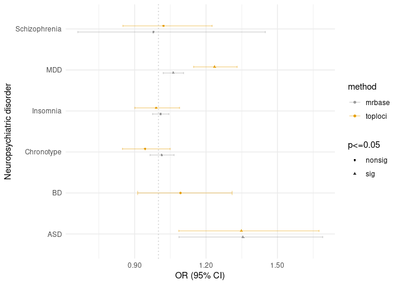
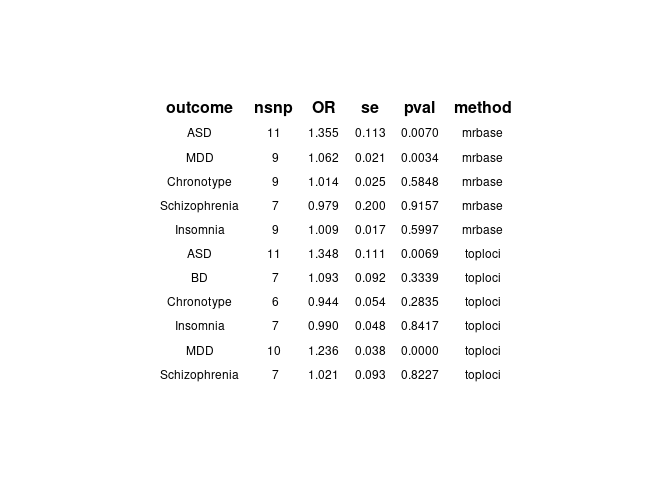
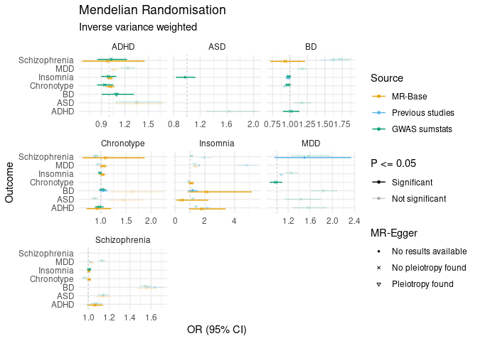
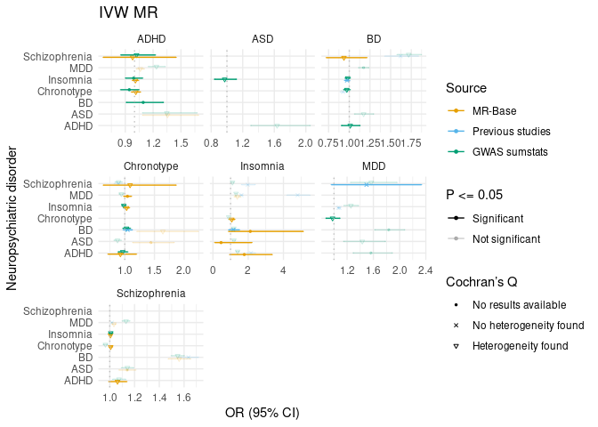
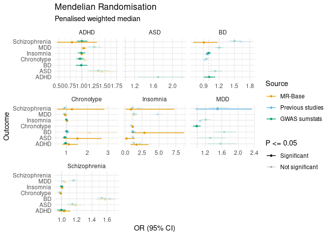

MR analysis for neuropsychatric disorders and chronotype.
================
Shane Crinion
4/29/2021

#### Mendelian Randomisation analysis for neuropsychatric disorders and chronotype.

As part of my research, I explored used Mendelian randomisation (MR) to
explore the causal relationship between neuropsychiatric disorders and
chronotype. This report summaries the results from each individual MR
analysis. The reader can recreate the MR analysis and generate the
required data using the script <code>1\_performMR.R</code>.

This report outlines the results performed from MR analysis of
neuropsychiatric disorders and chronotype.

*(To do: Insert table which indicates dataset, source, ethnicity,
reported snps vs snps used in r.)*

### 1\. Import, format and filter data:

Import results from current MR analysis and, for comparison, previous MR
analyses. Extract subsets of the data based on p-value, the type of MR
analysis performed (inverse variance weighted, weighted median or
penalised weighted median) and the data source used (mrbase, toploci or
sumstats) for the exposure.

#### 1\) Import results from current MR analysis

Some naming conventions require extraction of data source info from
<code>filename</code>.

Standardise exposure names.

Use effect estimates (beta) to create binary variable
<code>Direction</code>:

``` r
# define the direction of effect 
tbl[tbl$b > 0,"Direction"] <- "Increase"  # when exposure increases risk of outcome
tbl[tbl$b < 0,"Direction"] <- "Decrease"
```

#### 2\) Filter results by MR approach, p-value or data source.

We will first extract results 1) using the inverse variance weighted
approach MR approach (<code>tbl.ivw.csv</code>), 2) the p \< 0.05
subset, grouped by exposure and outcome
(<code>sig.results.grouped.csv</code>), 3) Data source - 3 types of data
were used to extract genetic instruments in this MR analysis: 3.1)
Genetic instruments from MRBase data 3.2) Independent SNPs with p \<
5e-18 from newest available GWAS data 3.3) top SNPs reported in GWAS
paper.

1)  MR approach - inverse variance weighted (<code>tbl.ivw.csv</code>).

We will look at weighted median and penalised weighted median later.

``` r
tbl.ivw <-
  tbl %>%
  filter(method=="Inverse variance weighted")
#write.csv(x=tbl.ivw,file = 'tbl.ivw.csv')
```

2)  the p \< 0.05 subset

<!-- end list -->

``` r
# extract sig, ivw
sig.results <-
  tbl %>% 
  filter(pval<=0.05 & 
           method=="Inverse variance weighted") %>%
  arrange(pval)

# group results and write to file
sig.results.grouped <-
  sig.results %>%
  arrange(exposure, outcome, filename)
#write.csv(x=sig.results.grouped,file = 'sig.results.grouped.csv')
```

3.1) MRBase data - <code>mrbase</code>

MR-Base provides numerous data sets for each exposure and outcome (eg.
older datasets). A unique MR analysis was performed for each of these so
here we filter to include only 1 MR analysis for each unique
exposure-outcome test. The analysis with the lowest p-val is selected
for each unique exposure-outcome analysis using MRBase data. Note: All
MR-Base data has been filtered to European ancestry.

``` r
mrbase.top <-
  tbl.ivw %>% 
  filter(., grepl("mrbase", filename)) %>%
  group_by(exposure, outcome) %>%
  filter(pval==min(pval)) 

# first few lines of results using mrbase data
attach(mrbase.top)
mrbase.top[order(-pval, decreasing = T),c("exposure", "outcome", "method", "nsnp", "b", "se", "pval", "Direction", "filename")][1:10,]
```

    ## # A tibble: 10 x 9
    ## # Groups:   exposure, outcome [10]
    ##    exposure  outcome method   nsnp      b      se     pval Direction filename   
    ##    <chr>     <chr>   <chr>   <dbl>  <dbl>   <dbl>    <dbl> <chr>     <chr>      
    ##  1 Schizoph… BD      Invers…    79 0.445  0.0299  6.13e-50 Increase  exp.schizo…
    ##  2 Insomnia  MDD     Invers…    25 0.323  0.0746  1.46e- 5 Increase  exp.sleepl…
    ##  3 Schizoph… ASD     Invers…    70 0.131  0.0305  1.70e- 5 Increase  exp.schizo…
    ##  4 Schizoph… MDD     Invers…    69 0.0327 0.00839 9.79e- 5 Increase  exp.schizo…
    ##  5 Chronoty… BD      Invers…    83 0.496  0.159   1.88e- 3 Increase  exp.mornin…
    ##  6 Chronoty… ASD     Invers…    72 0.365  0.123   3.02e- 3 Increase  exp.mornin…
    ##  7 ADHD      MDD     Invers…     9 0.0602 0.0205  3.39e- 3 Increase  exp.adhd.m…
    ##  8 ADHD      ASD     Invers…    11 0.304  0.113   7.05e- 3 Increase  exp.adhd.m…
    ##  9 Insomnia  ADHD    Invers…    25 0.576  0.327   7.77e- 2 Increase  exp.sleepl…
    ## 10 Schizoph… ADHD    Invers…    69 0.0605 0.0352  8.58e- 2 Increase  exp.schizo…

2)  Independent SNPs with p \< 5e-18 from newest available GWAS data -
    <code>sumstats</code> & 3) top SNPs reported in GWAS paper -
    <code>toploci</code>.

<!-- end list -->

``` r
newdat.top <-
  tbl.ivw %>% 
  filter(., grepl("sumstats", filename) & grepl("toploci", filename)) %>%
  group_by(exposure, outcome) %>%
 filter(pval==min(pval)) 
```

Combine results generated from <code>toploci</code>,
<code>toploci</code> and <code>mrbase</code>.

``` r
mrbase.newdata.comb <- 
  bind_rows(mrbase.top, newdat.top)

mrbase.newdata.comb[grepl("mrbase", mrbase.newdata.comb$filename),]$method <- "mrbase"
mrbase.newdata.comb[grepl("toploci", mrbase.newdata.comb$filename),]$method <- "toploci"
mrbase.newdata.comb <-
  mrbase.newdata.comb %>%
  mutate(`p<=0.05`=if_else(pval <= 0.05, "sig", "nonsig"))
```

#### 3\) Import results from previous MR studies.

Import and annotate previous results as required. The imported results
contains all significant MR results to-date from the largest available
GWAS for our selected traits.

``` r
previous.results <- read.csv('~/Downloads/previous-MR-subset-formatted - previous-MR-subset.csv')
#calculate ci and combine
previous.results$b <- previous.results$BETA
previous.results$OR <- exp(previous.results$BETA)
previous.results$CI_lower <- 
  exp(previous.results$BETA-(1.96*previous.results$se))
previous.results$CI_upper <- 
  exp(previous.results$BETA+(1.96*previous.results$se))
previous.results <-
  previous.results %>%
   mutate(`p<=0.05`=if_else(pval <= 0.05, "sig", "nonsig"))

all.results <- # combine all results
bind_rows(mrbase.newdata.comb, previous.results)
```

Round values for odds ratio, confidence interval and standard errors.

``` r
options(scipen=10000)
all.results.simplified <-
all.results %>% mutate_at(vars(OR,CI_lower,CI_upper,se), funs(round(.,3))) %>%
  mutate_at(vars(pval), funs(round(.,4)))
```

##### 4.1) Import results from sensitivity tests - MR Egger

MR Egger is a more stringent MR test that accounts for horizontal
pleiotropy by including the intercept. Import all results from MR Egger.
Here we import the results from the MR-Egger test, saved as
<code>pleiotropy.csv</code> in each subdirectory.

``` r
# import results
pleiotropy.results <- 
  list.files(path = "./results/",
             pattern = "*pleiotropy",
             recursive =  T,include.dirs = T,
             full.names = T) %>%
      map_df(function(x) read_csv(x, col_types = cols(.default = "c")) %>% mutate(filename=gsub("./results//|/pleiotropy.csv","",x))) 


# some exposure names not saved during MRanalysis, extract from directory name
pleiotropy.results <- pleiotropy.results %>%
  mutate(
    exposure = 
    ifelse(exposure == "exposure", 
           str_split(filename, pattern="[.]", simplify = T)[,2], 
           exposure))

### standardise the names of each exposure and outcome for continuity 
# exposure
pleiotropy.results[str_detect(toupper(pleiotropy.results$exposure), "SCHIZOPHRENIA"),]$exposure <- "Schizophrenia"
pleiotropy.results[str_detect(toupper(pleiotropy.results$exposure), toupper("ASD|Autism")),]$exposure <- "ASD"
pleiotropy.results[str_detect(toupper(pleiotropy.results$exposure), toupper("Depressive|Depression|depression|depression2018ex23andme|depresssion2018ex23andme|MDD")),]$exposure <- "MDD"
pleiotropy.results[str_detect(toupper(pleiotropy.results$exposure), toupper("Insomnia")),]$exposure <- "Insomnia"
pleiotropy.results[str_detect(toupper(pleiotropy.results$exposure), "ADHD"),]$exposure <- "ADHD"
pleiotropy.results[str_detect(toupper(pleiotropy.results$exposure), toupper("chronotype|Chronotype|morningness")),]$exposure <- "Chronotype"
pleiotropy.results[str_detect(toupper(pleiotropy.results$exposure), toupper("bipolar|bipolardisorder|Bipolar|BIP")),]$exposure <- "BD"

# outcome
pleiotropy.results[str_detect(toupper(pleiotropy.results$outcome), "SCHIZOPHRENIA"),]$outcome <- "Schizophrenia"
pleiotropy.results[str_detect(toupper(pleiotropy.results$outcome), toupper("ASD|Autism")),]$outcome <- "ASD"
pleiotropy.results[str_detect(toupper(pleiotropy.results$outcome), toupper("Depressive|Depression|depression|depression2018ex23andme|depresssion2018ex23andme|MDD")),]$outcome <- "MDD"
pleiotropy.results[str_detect(toupper(pleiotropy.results$outcome), toupper("Insomnia")),]$outcome <- "Insomnia"
pleiotropy.results[str_detect(toupper(pleiotropy.results$outcome), "ADHD"),]$outcome <- "ADHD"
pleiotropy.results[str_detect(toupper(pleiotropy.results$outcome), toupper("chronotype|Chronotype|morningness")),]$outcome <- "Chronotype"
pleiotropy.results[str_detect(toupper(pleiotropy.results$outcome), toupper("bipolar|bipolardisorder|Bipolar|BIP")),]$outcome <- "BD"
```

Combine these results with main results:

``` r
# create a table which includes mr egger data
all.results.egger <- dplyr::right_join(pleiotropy.results, all.results, by=c("id.outcome", "id.exposure", "filename", "exposure", "outcome"))
all.results.egger <- subset(all.results.egger, select = -c(X1.x, Exposure, Outcome, Category, X1.y,X, BETA))
names(all.results.egger) <- c("id.exposure", "id.outcome", "outcome", "exposure", "egger_intercept", "se.egger", 'pval.egger', 'filename', 'method', 'nsnp', 'b', 'se', 'pval', 'OR', 'CI_lower', 'CI_upper', 'Direction', 'p<=0.05', 'MR', 'Paper', 'Note')
```

Create binary variable:

``` r
all.results.egger <-
  all.results.egger %>%
  mutate(`pval.egger<=0.05`=if_else(`pval.egger` <= 0.05, "pleitropy", "no pleiotropy"))

all.results.egger[is.na(all.results.egger$`pval.egger<=0.05`),]$`pval.egger<=0.05` <- "no data"
all.results.egger$`p<=0.05` <- as.factor(all.results.egger$`p<=0.05`)
```

##### 4.2) Import results from sensitivity tests - Cochran’s Q

Heterogeneity refers to variation among the causal estimates for the
genetic instruments. Significant heterogeneity is indicative of Now to
import the heterogeneity data.

``` r
heterogeneity.results <- 
  list.files(path = "./results/",
             pattern = "*heterogeneity",
             recursive =  T,include.dirs = T,
             full.names = T) %>%
      map_df(function(x) read_csv(x, col_types = cols(.default = "c")) %>% mutate(filename=gsub("./results//|/heterogeneity.csv","",x))) 

# some exposure names not saved during MRanalysis, extract from directory name
heterogeneity.results <- heterogeneity.results %>%
  mutate(
    exposure = 
    ifelse(exposure == "exposure", 
           str_split(filename, pattern="[.]", simplify = T)[,2], 
           exposure))
```

Standardise the naming of each exposure and outcome.

``` r
### standardise the names of each exposure and outcome for continuity 
# exposure
heterogeneity.results[str_detect(toupper(heterogeneity.results$exposure), "SCHIZOPHRENIA"),]$exposure <- "Schizophrenia"
heterogeneity.results[str_detect(toupper(heterogeneity.results$exposure), toupper("ASD|Autism")),]$exposure <- "ASD"
heterogeneity.results[str_detect(toupper(heterogeneity.results$exposure), toupper("Depressive|Depression|depression|depression2018ex23andme|depresssion2018ex23andme|MDD")),]$exposure <- "MDD"
heterogeneity.results[str_detect(toupper(heterogeneity.results$exposure), toupper("Insomnia")),]$exposure <- "Insomnia"
heterogeneity.results[str_detect(toupper(heterogeneity.results$exposure), "ADHD"),]$exposure <- "ADHD"
heterogeneity.results[str_detect(toupper(heterogeneity.results$exposure), toupper("chronotype|Chronotype|morningness")),]$exposure <- "Chronotype"
heterogeneity.results[str_detect(toupper(heterogeneity.results$exposure), toupper("bipolar|bipolardisorder|Bipolar|BIP")),]$exposure <- "BD"

# outcome
heterogeneity.results[str_detect(toupper(heterogeneity.results$outcome), "SCHIZOPHRENIA"),]$outcome <- "Schizophrenia"
heterogeneity.results[str_detect(toupper(heterogeneity.results$outcome), toupper("ASD|Autism")),]$outcome <- "ASD"
heterogeneity.results[str_detect(toupper(heterogeneity.results$outcome), toupper("Depressive|Depression|depression|depression2018ex23andme|depresssion2018ex23andme|MDD")),]$outcome <- "MDD"
heterogeneity.results[str_detect(toupper(heterogeneity.results$outcome), toupper("Insomnia")),]$outcome <- "Insomnia"
heterogeneity.results[str_detect(toupper(heterogeneity.results$outcome), "ADHD"),]$outcome <- "ADHD"
heterogeneity.results[str_detect(toupper(heterogeneity.results$outcome), toupper("chronotype|Chronotype|morningness")),]$outcome <- "Chronotype"
heterogeneity.results[str_detect(toupper(heterogeneity.results$outcome), toupper("bipolar|bipolardisorder|Bipolar|BIP")),]$outcome <- "BD"
```

Combine results from MR analysis and sensitivity tests for horizontal
pleiotropy and heterogeneity.

``` r
all.results.egger.het.ivw <- 
  right_join(heterogeneity.results[heterogeneity.results$method=="Inverse variance weighted",],
           all.results.egger, by=c("id.exposure", "id.outcome", "outcome", "exposure", "filename"))

all.results.egger.het.ivw <-
all.results.egger.het.ivw %>%
  mutate(`pval.het<=0.05`=if_else(`Q_pval` <= 0.05, "heterogeneity", "no heterogeneity"))

all.results.egger.het.egger <- 
  right_join(heterogeneity.results[heterogeneity.results$method=="MR Egger",],
           all.results.egger, by=c("id.exposure", "id.outcome", "outcome", "exposure", "filename"))

all.results.egger.het.egger <-
all.results.egger.het.egger %>%
  mutate(`pval.het<=0.05`=if_else(`Q_pval` <= 0.05, "heterogeneity", "no heterogeneity"))
```

Now plot with heterogeneity results replacing MR Egger

``` r
# add info for heterogeneity tests of MR Egger
all.results.egger.het.ivw[is.na(all.results.egger.het.ivw$`pval.het<=0.05`),]$`pval.het<=0.05` <- "no data"
all.results.egger.het.ivw <- all.results.egger.het.ivw[-c(63,13),]
all.results.egger.het.ivw <- subset(all.results.egger.het.ivw, select= -c(method.x))
names(all.results.egger.het.ivw)[13] <- "method"

# add info for heterogeneity tests of IVW
all.results.egger.het.egger[is.na(all.results.egger.het.egger$`pval.het<=0.05`),]$`pval.het<=0.05` <- "no data"
all.results.egger.het.egger <- all.results.egger.het.egger[-c(63,13),]
all.results.egger.het.egger <- subset(all.results.egger.het.egger, select= -c(method.x))
names(all.results.egger.het.egger)[13] <- "method"
```

### 2\. Visualize results from IVW MR analysis

The following tables and plots extract results are used to compare
results for MR analysis across all exposure-outcome pairs. Each of the
following were tested as an exposure and an outcome: ADHD, ASD, BD,
chronotype, insomnia, MDD and schizophrenia.

#### 1\) Forest plot and table by exposure.

Below is an example of MR results with ADHD as exposure. The y-axis
represents each outcome. Each dot represents the odds ratio and the
error bars. The shape of the dot indicates whether result is significant
and colour indicates the data source used. This can be recreated for all
traits by replacing <code>exp\_choice</code> with the desired exposure.
Uncomment <code>ggsave()</code> and to save the plot.

Plot:

``` r
exp_choice <- "ADHD" #exposure to plot
# The palette with grey:
cbPalette <- c("#999999", "#E69F00", "#56B4E9", "#009E73", "#F0E442", "#0072B2", "#D55E00", "#CC79A7")
# The palette with black:
#cbPalette <- c("#000000", "#E69F00", "#56B4E9", "#009E73", "#F0E442", "#0072B2", "#D55E00", "#CC79A7")
p1 <- 
 ggplot(subset(all.results, exposure==exp_choice), aes(x=OR,y=outcome)) +
    geom_point(aes(colour=method, shape=`p<=0.05`), position= position_dodge(0.3), size=1) +
  geom_errorbar(width=.1,
                aes(xmin=CI_lower,xmax=CI_upper, color=method),
                position=position_dodge(0.3), width=0.2, alpha=0.4) +
  geom_vline(xintercept = 1,linetype="dotted", colour="grey",size=0.5)+
  theme(title = element_text(hjust=0.5)) +
  xlab("OR (95% CI)") + 
  ylab ("Neuropsychiatric disorder") +
  theme_minimal() +
  scale_colour_manual(values=cbPalette) +
  # To use for fills, add
  scale_fill_manual(values=cbPalette) + scale_x_continuous(labels = comma)
#ggsave('MR-results.Chronotype.plot.png', plot = p1, dpi = 200, height = 4, width = 7)
p1
```

<!-- -->

Print friendly table for ADHD results:

``` r
mytheme <- ttheme_minimal(core = list(fg_params=list(cex = 0.75)))
#png("MR-results.Chronotype.table.png")
grid.arrange(
  #p1,
  tableGrob(subset(all.results.simplified, exposure==exp_choice)[c("outcome", "nsnp", "OR","se", "pval", "method")], theme=mytheme, rows=NULL),
  ncol = 1, nrow=1, clip=F)
```

<!-- -->

``` r
#dev.off()
```

Save the above table by uncommenting the <code>png()</code> and
<code>dev.off</code> functions.

#### 2\) Forest plot for cross-trait comparison of all exposures.

``` r
ggplot(subset(x = all.results[-c(32),]),
       aes(x=OR,y=outcome)) +
  geom_point(aes(colour=method, shape=`p<=0.05`), position= position_dodge(0.3), size=1) +
  geom_errorbar(width=.1,
                aes(xmin=CI_lower,xmax=CI_upper, color=method),
                position=position_dodge(0.3), width=0.2, alpha=0.4) +
  #geom_label(aes(OR+0.18,label=paste("P =", pval),family="serif"),
  #           label.size =0)+
  geom_vline(xintercept = 1,linetype="dotted", colour="grey",size=0.5)+
  theme(title = element_text(hjust=0.5)) +
  xlab("OR (95% CI)") + 
  ylab ("Neuropsychiatric disorder") +
  facet_wrap(~exposure, scales = "free_x") +
  theme_minimal() +
  scale_colour_manual(values=cbPalette) +
  # To use for fills, add
  scale_fill_manual(values=cbPalette)
```

<!-- -->

``` r
#ggsave("results-MR.png", dpi=300) 
```

#### 3\) Sensitivity test for horizontal pleiotropy (MR Egger).

Now let’s import the MR Egger test results to identify the presence of
horizontal pleiotropy. If MR-Egger intercept is \> 0 and p is \< 0.05
then there is evidence of horizontal pleiotropy.

``` r
ggplot(subset(x = all.results.egger[-c(63,13),]), # clear measurement error in rows 13 and 63
       aes(x=OR,y=outcome)) +
  geom_point(aes(colour=method, shape=`pval.egger<=0.05`, alpha=`p<=0.05`),size=1, position= position_dodge(0.4)) +
  geom_errorbar(width=.1,
                aes(xmin=CI_lower,xmax=CI_upper, colour=method, alpha=`p<=0.05`),
                position=position_dodge(0.4)) +
  #geom_label(aes(OR+0.18,label=paste("P =", pval),family="serif"),
  #           label.size =0)+
  geom_vline(xintercept = 1,linetype="dotted", colour="grey",size=0.5)+
  theme(title = element_text(hjust=0.5),plot.title = element_text(size = 15)) +
  xlab("OR (95% CI)") + 
  ylab ("Outcome") +
  ggtitle("Mendelian Randomisation", "Inverse variance weighted") +
  facet_wrap(~exposure, scales = "free_x") +
  theme_minimal() +
 scale_colour_manual(values=cbPalette[-1],labels=c("MR-Base","Previous studies","GWAS sumstats")) +
  # To use for fills, add
  scale_fill_manual(values=cbPalette[-1]) +
  scale_alpha_manual(values =c (1,0.2), labels=c("Significant", "Not significant")) + 
  scale_shape_manual(values= c(20,4,25),labels=c("No results available","No pleiotropy found", "Pleiotropy found")) +
  guides(color= guide_legend(order=1,title = "Source"), 
         shape=guide_legend(order=3,title = "MR-Egger"),
         alpha=guide_legend(order=2, title="P <= 0.05"))
```

<!-- -->

``` r
#ggsave("mrresults.egger.png", units = "in", height = 6, width=11, dpi = 300)
```

#### 3\) Sensitivity test for heterogeneity (Cochran’s Q statistic).

``` r
ggplot(subset(x = all.results.egger.het.ivw), # clearly measurement issues with the 2 row removed
       aes(x=OR,y=outcome)) +
  geom_point(aes(colour=method, shape=`pval.het<=0.05`, alpha=`p<=0.05`),size=1, position= position_dodge(0.4)) +
  geom_errorbar(width=.1,
                aes(xmin=CI_lower,xmax=CI_upper, colour=method, alpha=`p<=0.05`),
                position=position_dodge(0.4)) +
  #geom_label(aes(OR+0.18,label=paste("P =", pval),family="serif"),
  #           label.size =0)+
  geom_vline(xintercept = 1,linetype="dotted", colour="grey",size=0.5)+
  theme(title = element_text(hjust=0.5),plot.title = element_text(size = 15)) +
  xlab("OR (95% CI)") + 
  ylab ("Neuropsychiatric disorder") +
  ggtitle("IVW MR") +
  facet_wrap(~exposure, scales = "free_x") +
  theme_minimal() +
 scale_colour_manual(values=cbPalette[-1],labels=c("MR-Base","Previous studies","GWAS sumstats")) +
  # To use for fills, add
  scale_fill_manual(values=cbPalette[-1]) +
  scale_alpha_manual(values =c (1,0.2), labels=c("Significant", "Not significant")) + 
  scale_shape_manual(values= c(20,4,25),labels=c("No results available","No heterogeneity found", "Heterogeneity found")) +
  guides(color= guide_legend(order=1,title = "Source"), 
         shape=guide_legend(order=3,title = "Cochran’s Q"),
         alpha=guide_legend(order=2, title="P <= 0.05"))
```

<!-- -->

#### 4\) Inspect effect sizes using funnelplots

The funnelplots plot the effect size for each instrument. This can be
used to identify asymmetry in the heterogeneity results, which can be
indicative of horizontal pleiotropy. It appears however than in our
case, that any heterogeneity occurs from weak instruments which will
bias the results towards the null. Generate the files with all funnel
plots and explore the distribution.

Firstly, explore for <code>sumstats</code> data.

``` r
funnelplots <-
# get list of all the sumstats files with 
  list.files(path = "./results",
             pattern = "funnelplot.png*",
             recursive =  T,include.dirs = T,
             full.names = T) %>%
  str_subset(., "sumstats")
rl = lapply(funnelplots, png::readPNG) # don't print
gl = lapply(rl, grid::rasterGrob) 
#gridExtra::grid.arrange(grobsnews=gl[1:16], nrow=4)
g <- marrangeGrob(grobs = gl, nrow=4, ncol=4)
#ggsave(file="multipage.pdf", g)
```

Then, the <code>mrbase</code> data (generally older).

``` r
funnelplots.mrbasedat <- paste0("./results/",str_subset(all.results.egger$filename, "mrbase"), "/funnelplot.png") 
rl = lapply(funnelplots.mrbasedat, png::readPNG) # don't print
gl = lapply(rl, grid::rasterGrob) 
#gridExtra::grid.arrange(grobsnews=gl[1:16], nrow=4)
g <- marrangeGrob(grobs = gl, nrow=4, ncol=4)
#ggsave(file="multipage.mrbase.pdf", g)
```

### 3\. Visualize results from other MR analysis (penalised median and penalised weighted median)

Now visualise results from other variations of MR analysis performed
(Weighted median and penalised weighted median)

#### 3.1 Weighted median

Extract WM results, sig results and split by data source.

``` r
tbl.wm <-
  tbl %>%
  filter(method=="Weighted median")
#write.csv(x=tbl.wm,file = 'tbl.weightedmedian.csv')

# extract sig, ivw
sig.results <-
  tbl %>% 
  filter(pval<=0.05 & 
           method=="Weighted median") %>%
  arrange(pval)

mrbase.top <-
  tbl.wm %>% 
  filter(., grepl("mrbase", filename)) %>%
  group_by(exposure, outcome) %>%
  filter(pval==min(pval)) 

newdat.top <-
  tbl.wm %>% 
  filter(., grepl("sumstats", filename) & grepl("toploci", filename)) %>%
  group_by(exposure, outcome) %>%
 filter(pval==min(pval)) 
```

Combine and label results from <code>toploci</code> and
<code>mrbase</code>.

``` r
mrbase.newdata.comb <- 
  bind_rows(mrbase.top, newdat.top)

mrbase.newdata.comb[grepl("mrbase", mrbase.newdata.comb$filename),]$method <- "mrbase"
mrbase.newdata.comb[grepl("toploci", mrbase.newdata.comb$filename),]$method <- "toploci"
mrbase.newdata.comb <-
  mrbase.newdata.comb %>%
  mutate(`p<=0.05`=if_else(pval <= 0.05, "sig", "nonsig"))
```

Combine with previous results.

``` r
all.results <-
bind_rows(mrbase.newdata.comb, previous.results)
```

Aaaand plot

``` r
ggplot(subset(x = all.results), 
       aes(x=OR,y=outcome)) +
  geom_point(aes(colour=method, alpha=`p<=0.05`),size=1, position= position_dodge(0.4)) +
  geom_errorbar(width=.1,
                aes(xmin=CI_lower,xmax=CI_upper, colour=method, alpha=`p<=0.05`),
                position=position_dodge(0.4)) +
  #geom_label(aes(OR+0.18,label=paste("P =", pval),family="serif"),
  #           label.size =0)+
  geom_vline(xintercept = 1,linetype="dotted", colour="grey",size=0.5)+
  theme(title = element_text(hjust=0.5),plot.title = element_text(size = 15)) +
  xlab("OR (95% CI)") + 
  ylab ("Outcome") +
  ggtitle("Mendelian Randomisation", "Weighted median") +
  facet_wrap(~exposure, scales = "free_x") +
  theme_minimal() +
 scale_colour_manual(values=cbPalette[-1],labels=c("MR-Base","Previous studies","GWAS sumstats")) +
  # To use for fills, add
  scale_fill_manual(values=cbPalette[-1]) +
  scale_alpha_manual(values =c (1, 0.2), labels=c("Significant", "Not significant")) + 
  guides(color= guide_legend(order=1,title = "Source"), 
         alpha=guide_legend(order=2, title="P <= 0.05"))
```

<!-- -->

``` r
#ggsave("mrresults.wm.egger.png", units = "in", height = 6, width=11, dpi = 300)
```

#### 3.2 Penalised weighted median

``` r
tbl.pwm <-
  tbl %>%
  filter(method=="Penalised weighted median")
#write.csv(x=tbl.pwm,file = 'tbl.penweightedmedian.csv')

# extract sig, ivw
sig.results <-
  tbl %>% 
  filter(pval<=0.05 & 
           method=="Penalised weighted median") %>%
  arrange(pval)
```

``` r
mrbase.top <-
  tbl.pwm %>% 
  filter(., grepl("mrbase", filename)) %>%
  group_by(exposure, outcome) %>%
  filter(pval==min(pval)) 
```

Extract results using new data:

``` r
newdat.top <-
  tbl.pwm %>% 
  filter(., grepl("sumstats", filename) & grepl("toploci", filename)) %>%
  group_by(exposure, outcome) %>%
 filter(pval==min(pval)) 
```

Combine results from toploci and mrbase.

``` r
mrbase.newdata.comb <- 
  bind_rows(mrbase.top, newdat.top)

mrbase.newdata.comb[grepl("mrbase", mrbase.newdata.comb$filename),]$method <- "mrbase"
mrbase.newdata.comb[grepl("toploci", mrbase.newdata.comb$filename),]$method <- "toploci"
mrbase.newdata.comb <-
  mrbase.newdata.comb %>%
  mutate(`p<=0.05`=if_else(pval <= 0.05, "sig", "nonsig"))
```

Include the results from previous MR

``` r
all.results <-
bind_rows(mrbase.newdata.comb, previous.results)
```

Aaaaand plot

``` r
ggplot(subset(x = all.results), # clearly measurement issues with the 2 row removed
       aes(x=OR,y=outcome)) +
  geom_point(aes(colour=method, alpha=`p<=0.05`),size=1, position= position_dodge(0.4)) +
  geom_errorbar(width=.1,
                aes(xmin=CI_lower,xmax=CI_upper, colour=method, alpha=`p<=0.05`),
                position=position_dodge(0.4)) +
  #geom_label(aes(OR+0.18,label=paste("P =", pval),family="serif"),
  #           label.size =0)+
  geom_vline(xintercept = 1,linetype="dotted", colour="grey",size=0.5)+
  theme(title = element_text(hjust=0.5),plot.title = element_text(size = 15)) +
  xlab("OR (95% CI)") + 
  ylab ("Outcome") +
  ggtitle("Mendelian Randomisation", "Penalised weighted median") +
  facet_wrap(~exposure, scales = "free_x") +
  theme_minimal() +
 scale_colour_manual(values=cbPalette[-1],labels=c("MR-Base","Previous studies","GWAS sumstats")) +
  # To use for fills, add
  scale_fill_manual(values=cbPalette[-1]) +
  scale_alpha_manual(values =c (1, 0.2), labels=c("Significant", "Not significant")) + 
  guides(color= guide_legend(order=1,title = "Source"), 
         alpha=guide_legend(order=2, title="P <= 0.05"))
```

<!-- -->

``` r
#ggsave("mrresults.pwm.egger.png", units = "in", height = 6, width=11, dpi = 300)
```
